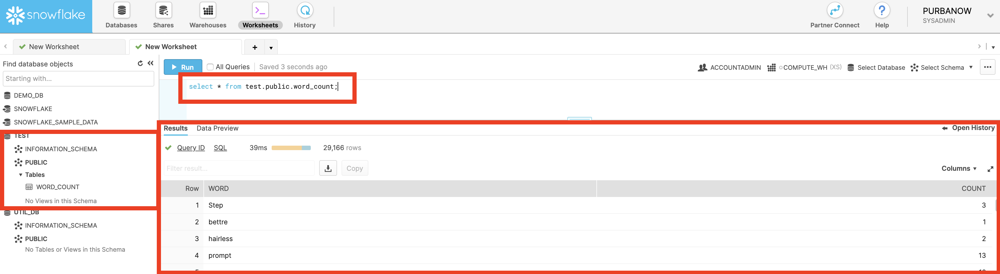
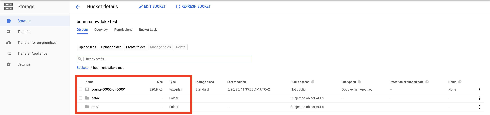
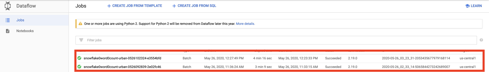
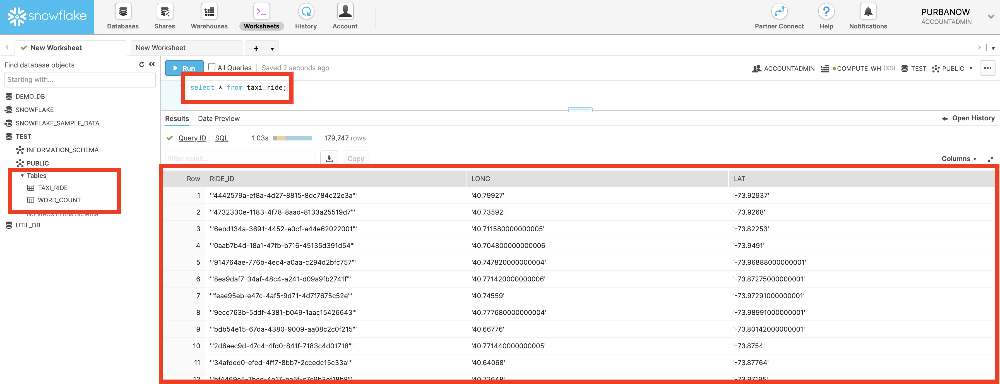
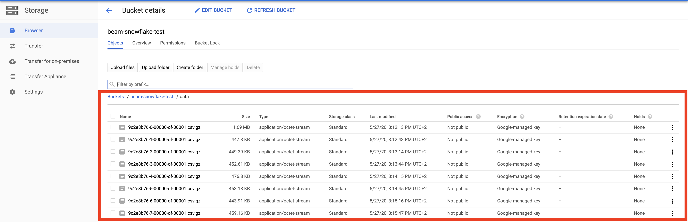
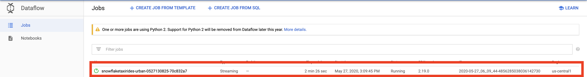
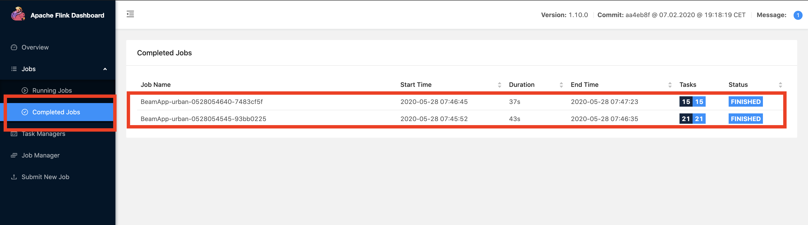
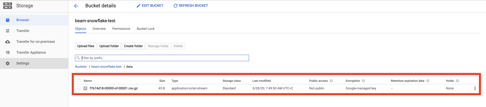
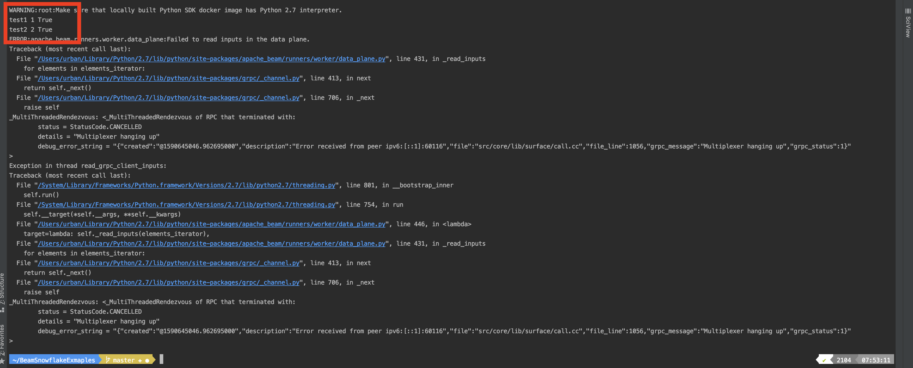

## BeamSnowflakeExamples

This repository contains examples of using [Snowflake](https://www.snowflake.com/) with [Apache Beam](https://github.com/apache/beam).
Precisely contains batching, streaming and cross-language usage examples.  

### Table of Contents 
1. [Setup required by all examples](#setup-required-by-all-examples)  
2. [Batching example](#batching-example) 
3. [Streaming example](#streaming-example)
4. [Cross-language example](#cross-language-example)

### Setup required by all examples:
1. [Create Snowflake Account](https://trial.snowflake.com/?utm_cta=website-homepage-hero-free-trial&_ga=2.199198959.1328097007.1590138521-373661872.1583847959) 
with Google Cloud Platform as a cloud provider.
2. Make sure that your username have a default role set to ACCOUNTADMIN
    ```
    GRANT ROLE ACCOUNTADMIN TO user <USERNAME>
    alter user <USERNAME> set default_role=ACCOUNTADMIN; 
    ```
3. Make sure that your username have a default warehouse set 
    ```
    alter user <USERNAME> set default_warehouse=COMPUTE_WH;
    ```
4. [Create a new Snowflake database](https://docs.snowflake.com/en/sql-reference/sql/create-database.html):
    ```
    create database <DATABASE NAME>;
    ```
5. [Create Google Cloud Platform account](https://cloud.google.com/free).
6. [Create a new GCP project](https://cloud.google.com/resource-manager/docs/creating-managing-projects).
7. [Create GCP bucket](https://cloud.google.com/storage/docs/creating-buckets)
8. Create storage integration object in Snowflake using the following command:
    ```
    CREATE OR REPLACE STORAGE INTEGRATION <INTEGRATION NAME>
    TYPE = EXTERNAL_STAGE
    STORAGE_PROVIDER = GCS
    ENABLED = TRUE
    STORAGE_ALLOWED_LOCATIONS = ('gcs://<BUCKET NAME>/');
    ```
   Please note that `gcs` prefix is used here, not `gs`.
9. Authorize Snowflake to operate on your bucket by following [Step 3. Grant the Service Account Permissions to Access Bucket Objects](https://docs.snowflake.com/en/user-guide/data-load-gcs-config.html#step-3-grant-the-service-account-permissions-to-access-bucket-objects)
10. Setup gcloud on your computer by following [Using the Google Cloud SDK installer](https://cloud.google.com/sdk/docs/downloads-interactive)
11. Run one of the provided examples.

### Batching example
An example contains batch writing into Snowflake and batch reading from Snowflake. Inspired by [Apache Beam/WordCount-example](https://github.com/apache/beam/blob/master/examples/java/src/main/java/org/apache/beam/examples/WordCount.java).

An example consists of two pipelines:
* Writing into Snowflake
    1. Reading files from provided by `inputFile` argument. 
    2. Counting words
    3. Writing counts into Snowflake table provided by `tableName` argument. 
* Reading from Snowflake
  1. Reading counts from Snowflake table provided by `tableName` argument.
  2. Writing counts into provided by `output` argument. 

#### Executing:  
1. Run batching example by executing following command:
    ```
    ./gradlew run -PmainClass=batching.WordCountExample --args="
        --inputFile=gs://apache-beam-samples/shakespeare/*
        --output=gs://<GCS BUCKET NAME>/counts
        --serverName=<SNOWFLAKE SERVER NAME>
        --username=<SNOWFLAKE USERNAME>
        --password=<SNOWFLAKE PASSWORD>
        --database=<SNOWFLAKE DATABASE>
        --schema=<SNOWFLAKE SCHEMA>  
        --tableName=<SNOWFLAKE TABLE NAME>  
        --storageIntegration=<SNOWFLAKE STORAGE INTEGRATION NAME> 
        --stagingBucketName=<GCS BUCKET NAME> 
        --runner=<DirectRunner/DataflowRunner>
        --project=<FOR DATAFLOW RUNNER: GCP PROJECT NAME> 
        --gcpTempLocation=<FOR DATAFLOW RUNNER: GCS TEMP LOCATION STARTING> 
        --region=<FOR DATAFLOW RUNNER: GCP REGION> 
        --appName=<OPTIONAL: DATAFLOW JOB NAME PREFIX>"
    ```
2. Go to Snowflake console to check saved counts:
    ```
    select  from <DATABASE NAME>.<SCHEMA NAME>.<TABLE NAME>;
    ```
     
3. Go to GCS bucket to check saved files:
     
4. Go to DataFlow to check submitted jobs:
     
    
    
### Streaming example
An example is streaming taxi rides from PubSub into Snowflake.

#### Extra setup: 
1. [Create Snowflake table](https://docs.snowflake.com/en/sql-reference/sql/create-table.html) which will be holding taxi rides
    ```
   create or replace table <TABLE NAME> (
        ride_id string ,
        long string ,
        lat string
   );
    ```
2. [Create Snowflake stage](https://docs.snowflake.com/en/sql-reference/sql/create-stage.html)
    ```
    create or replace stage <STAGE NAME>
    url = 'gcs://<GCS BUCKET NAME>/data/'
    storage_integration = <INTEGRATION NAME>;
    ```
3. [Create Key/Pair](https://docs.snowflake.com/en/user-guide/snowsql-start.html#using-key-pair-authentication)
for authentication process.
4. Set public key for user by executing following command:
    ```
    alter user <USERNAME> set rsa_public_key='';
    ```
5. Create Snowflake [Snowpipe](https://docs.snowflake.com/en/user-guide/data-load-snowpipe-intro.html)
    ```
    CREATE OR REPLACE PIPE <DATABASE NAME>.<SCHEMA NAME>.<PIPE NAME>
    AS COPY INTO <TABLE NAME> from @<STAGE NAME>;
    ```
   
#### Executing:  
1. Run streaming example by executing following command:
    ```
   ./gradlew run -PmainClass=streaming.TaxiRidesExample --args="
        --serverName=<SNOWFLAKE SERVER NAME>
        --username=<SNOWFLAKE USERNAME>
        --privateKeyPath=<>
        --privateKeyPassphrase=<> 
        --database=<SNOWFLAKE DATABASE>
        --schema=<SNOWFLAKE SCHEMA> 
        --snowPipe=<SNOWFLAKE SNOWPIPE NAME>
        --storageIntegration=<SNOWFLAKE STORAGE INTEGRATION NAME>
        --stagingBucketName=<GCS BUCKET NAME>
        --runner=<DirectRunner/DataflowRunner>
        --project=<FOR DATAFLOW RUNNER: GCP PROJECT NAME>
        --region=<FOR DATAFLOW RUNNER: GCP REGION>
        --appName=<OPTIONAL: DATAFLOW JOB NAME PREFIX>"
    ```
2. Go to Snowflake console to check saved taxi rides:
    ```
    select  from <DATABASE NAME>.<SCHEMA NAME>.<TABLE NAME>;
    ```
     
3. Go to GCS bucket to check saved files:
     
4. Go to DataFlow to check submitted jobs:
     
    
    
### Cross-language example
An example is showing simple usage of [cross-language](https://beam.apache.org/roadmap/portability/) by writing objects into Snowflake and reading them from Snowflake.
 
Currently, cross-language is supporting only by [Apache Flink](https://flink.apache.org/) as a runner in a stable manner but plans are to support all runners. 
For more information about cross-language please see [multi sdk efforts](https://beam.apache.org/roadmap/connectors-multi-sdk/) 
and [Beam on top of Flink](https://flink.apache.org/ecosystem/2020/02/22/apache-beam-how-beam-runs-on-top-of-flink.html) articles. 

#### Extra setup: 
Please see [Apache Beam with Flink runner](https://beam.apache.org/documentation/runners/flink/)  for a setup. The specific setup for current version of snowflake is following:
1. Setup a Flink cluster by following the Flink [Setup Quickstart](https://ci.apache.org/projects/flink/flink-docs-release-1.10/getting-started/tutorials/local_setup.html)
or [Setting up Apache Flink on Mac OS X](https://streambench.wordpress.com/2017/10/26/setting-up-apache-flink-on-mac-os-x/) 
2. Download Job server image:
```
docker pull gcr.io/snowflake-poli/apachebeam_flink1.10_job_server:snowflake
```
3. Download Apache Beam Java SDK image:
```
docker pull gcr.io/snowflake-poli/apachebeam_java_sdk:2.20.0.dev
```
4. Change tag of downloaded Java SDK image to make the whole setup work:
```
docker tag gcr.io/snowflake-poli/apachebeam_java_sdk:2.20.0.dev apache/beam_java_sdk:2.20.0.dev
```
5. Start Job server:
```
docker run -p 8099:8099 -p 8098:8098 -p 8097:8097 gcr.io/snowflake-poli/apachebeam_flink1.10_job_server:snowflake
```
6. Download [Apache Beam Python SDK](https://storage.cloud.google.com/snowflake_artifacts/apachebeam_snowflake.whl?_ga=2.54472813.-471657054.1583857613).
7. Install python Apache Beam Python SDK using Python 2.7
```  
python -m pip install apachebeam_snowflake.whl 
```

#### Executing:
1. Set variables inside xlang_example.py
    ```
   SERVER_NAME = <SNOWFLAKE SERVER NAME> 
   USERNAME = <SNOWFLAKE USERNAME>
   PASSWORD = <SNOWFLAKE PASSWORD>
   SCHEMA = <SNOWFLAKE SCHEMA>
   DATABASE = <SNOWFLAKE DATABASE>
   STAGING_BUCKET_NAME = <SNOWFLAKE STORAGE INTEGRATION NAME>
   STORAGE_INTEGRATION = <SNOWFLAKE STORAGE INTEGRATION NAME> 
   TABLE = <SNOWFLAKE TABLE NAME> 
    ``` 
2. Run xlang_example.py:
    ```
    python xlang_example.py 
    ```
2. [Go to Flink console](http://localhost:8081/)
    
3. Go to GCS bucket to check saved files:
    
4. Check console
    
