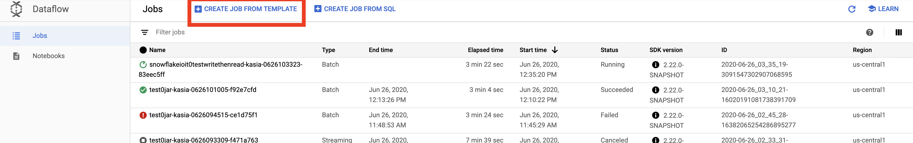

## BeamSnowflakeExamples

This repository contains examples of using [Snowflake](https://www.snowflake.com/) with [Apache Beam](https://github.com/apache/beam).
Precisely contains batching, streaming and cross-language usage examples.  

### Table of Contents 
1. [Setup required by all examples](#setup-required-by-all-examples)  
2. [Batching example](#batching-example) 
3. [Streaming example](#streaming-example)
4. [Google Dataflow templates](#google-dataflow-template-example)
5. [Cross-language example](#cross-language-example)

### Setup required by all examples:
1. [Create Snowflake Account](https://trial.snowflake.com/?utm_cta=website-homepage-hero-free-trial&_ga=2.199198959.1328097007.1590138521-373661872.1583847959) 
with Google Cloud Platform as a cloud provider.
2. Make sure that your username have a default role set to ACCOUNTADMIN
    ```
    GRANT ROLE ACCOUNTADMIN TO user <USERNAME>
    alter user <USERNAME> set default_role=ACCOUNTADMIN; 
    ```
3. Make sure that your username have a default warehouse set 
    ```
    alter user <USERNAME> set default_warehouse=COMPUTE_WH;
    ```
4. [Create a new Snowflake database](https://docs.snowflake.com/en/sql-reference/sql/create-database.html):
    ```
    create database <DATABASE NAME>;
    ```
5. [Create Google Cloud Platform account](https://cloud.google.com/free).
6. [Create a new GCP project](https://cloud.google.com/resource-manager/docs/creating-managing-projects).
7. [Create GCP bucket](https://cloud.google.com/storage/docs/creating-buckets)
8. Create storage integration object in Snowflake using the following command:
    ```
    CREATE OR REPLACE STORAGE INTEGRATION <INTEGRATION NAME>
    TYPE = EXTERNAL_STAGE
    STORAGE_PROVIDER = GCS
    ENABLED = TRUE
    STORAGE_ALLOWED_LOCATIONS = ('gcs://<BUCKET NAME>/');
    ```
   Please note that `gcs` prefix is used here, not `gs`.
9. Authorize Snowflake to operate on your bucket by following [Step 3. Grant the Service Account Permissions to Access Bucket Objects](https://docs.snowflake.com/en/user-guide/data-load-gcs-config.html#step-3-grant-the-service-account-permissions-to-access-bucket-objects)
10. Setup gcloud on your computer by following [Using the Google Cloud SDK installer](https://cloud.google.com/sdk/docs/downloads-interactive)
11. [Install gradle](https://gradle.org/install/)
12. Run following command to set gradle wrapper
    ```
    gradle wrapper
    ```
13. Run one of the provided examples.

### Batching example
An example contains batch writing into Snowflake and batch reading from Snowflake. Inspired by [Apache Beam/WordCount-example](https://github.com/apache/beam/blob/master/examples/java/src/main/java/org/apache/beam/examples/WordCount.java).

An example consists of two pipelines:
* Writing into Snowflake
    1. Reading files from provided by `inputFile` argument. 
    2. Counting words
    3. Writing counts into Snowflake table provided by `tableName` argument. 
* Reading from Snowflake
  1. Reading counts from Snowflake table provided by `tableName` argument.
  2. Writing counts into provided by `output` argument. 

#### Executing:  
1. Run batching example by executing following command:
    ```
    ./gradlew run -PmainClass=batching.WordCountExample --args=" \
        --inputFile=gs://apache-beam-samples/shakespeare/* \
        --output=gs://<GCS BUCKET NAME>/counts \
        --serverName=<SNOWFLAKE SERVER NAME> \
        --username=<SNOWFLAKE USERNAME> \
        --password=<SNOWFLAKE PASSWORD> \
        --database=<SNOWFLAKE DATABASE> \
        --schema=<SNOWFLAKE SCHEMA> \
        --tableName=<SNOWFLAKE TABLE NAME>  \
        --storageIntegrationName=<SNOWFLAKE STORAGE INTEGRATION NAME> \
        --stagingBucketName=<GCS BUCKET NAME> \
        --runner=<DirectRunner/DataflowRunner> \
        --project=<FOR DATAFLOW RUNNER: GCP PROJECT NAME> \
        --gcpTempLocation=<FOR DATAFLOW RUNNER: GCS TEMP LOCATION STARTING> \
        --region=<FOR DATAFLOW RUNNER: GCP REGION> \
        --appName=<OPTIONAL: DATAFLOW JOB NAME PREFIX>"
    ```
2. Go to Snowflake console to check saved counts:
    ```
    select  from <DATABASE NAME>.<SCHEMA NAME>.<TABLE NAME>;
    ```
     
3. Go to GCS bucket to check saved files:
     
4. Go to DataFlow to check submitted jobs:
     
    
    
### Streaming example
An example is streaming taxi rides from PubSub into Snowflake.

#### Extra setup: 
1. [Create Snowflake table](https://docs.snowflake.com/en/sql-reference/sql/create-table.html) which will be holding taxi rides
    ```
   create or replace table <TABLE NAME> (
        ride_id string ,
        long double ,
        lat double
   );
    ```
2. [Create Snowflake stage](https://docs.snowflake.com/en/sql-reference/sql/create-stage.html)
    ```
    create or replace stage <STAGE NAME>
    url = 'gcs://<GCS BUCKET NAME>/data/'
    storage_integration = <INTEGRATION NAME>;
    ```
   note: SnowflakeIO requires that url must have /data/ as a sufix 
3. [Create Key/Pair](https://docs.snowflake.com/en/user-guide/snowsql-start.html#using-key-pair-authentication)
for authentication process.
4. Set public key for user by executing following command:
    ```
    alter user <USERNAME> set rsa_public_key='';
    ```
5. Create Snowflake [Snowpipe](https://docs.snowflake.com/en/user-guide/data-load-snowpipe-intro.html)
    ```
    CREATE OR REPLACE PIPE <DATABASE NAME>.<SCHEMA NAME>.<PIPE NAME>
    AS COPY INTO <TABLE NAME> from @<STAGE NAME>;
    ```
   
#### Executing:  
1. Run streaming example by executing following command:
    ```
   ./gradlew run -PmainClass=streaming.TaxiRidesExample --args=" \
        --serverName=<SNOWFLAKE SERVER NAME>\
        --username=<SNOWFLAKE USERNAME>\
        --privateKeyPath=<KEY PATH> \
        --privateKeyPassphrase=<PASSWORD FOR KEY>  \
        --database=<SNOWFLAKE DATABASE> \
        --schema=<SNOWFLAKE SCHEMA> \
        --snowPipe=<SNOWFLAKE SNOWPIPE NAME> \
        --storageIntegrationName=<SNOWFLAKE STORAGE INTEGRATION NAME> \
        --stagingBucketName=<GCS BUCKET NAME> \
        --runner=<DirectRunner/DataflowRunner> \
        --project=<FOR DATAFLOW RUNNER: GCP PROJECT NAME> \
        --region=<FOR DATAFLOW RUNNER: GCP REGION> \
        --appName=<OPTIONAL: DATAFLOW JOB NAME PREFIX>"
    ```
2. Go to Snowflake console to check saved taxi rides:
    ```
    select  from <DATABASE NAME>.<SCHEMA NAME>.<TABLE NAME>;
    ```
     
3. Go to GCS bucket to check saved files:
     
4. Go to DataFlow to check submitted jobs:
     
    
### Google DataFlow template example
Google DataFlow is supporting [template creation](https://cloud.google.com/dataflow/docs/guides/templates/overview) which in practice means staging pipelines on Cloud Storage and 
run them from a variety of environments with ability to pass runtime parameters that are only available during pipeline execution.

#### Executing:
Below example is based on previous streaming example so remember to make required setup before executing this example. 
The essential part of this example is that serverName and snowPipe options will be passed at runtime. Please check below 
list for currently supported runtime options.
1. [Create Dataflow template](https://cloud.google.com/dataflow/docs/guides/templates/creating-templates#creating-and-staging-templates).
    ```
   ./gradlew clean execute -DmainClass=streaming.TaxiRidesExample -Dexec.args="\
        --runner=DataflowRunner\
        --project=<FOR DATAFLOW RUNNER: GCP PROJECT NAME> \
        --stagingLocation=gs://<GCS BUCKET NAME>/staging\
        --templateLocation=gs://<GCS BUCKET NAME>/templates/<TEMPLATE NAME>\
        --region=<GCP REGION>\  
        --storageIntegrationName=<SNOWFLAKE STORAGE INTEGRATION NAME> \
        --stagingBucketName=gs://<GCS BUCKET NAME>/ \
        --username=<SNOWFLAKE USERNAME>\
        --database=<SNOWFLAKE DATABASE> \
        --schema=<SNOWFLAKE SCHEMA> \
        --privateKeyPath=<KEY PATH> \
        --privateKeyPassphrase=<PASSWORD FOR KEY>"       
    ```
2. Go to GCS bucket to check saved template:
    
2. Run Dataflow template using [Cloud console](https://cloud.google.com/dataflow/docs/guides/templates/running-templates#google-provided-templates) or
[REST API](https://cloud.google.com/dataflow/docs/guides/templates/running-templates#using-the-rest-api) or
[gcloud](https://cloud.google.com/dataflow/docs/guides/templates/running-templates#using-gcloud) 
. Following steps shows how to execute using Dataflow console:
    1. Go to DataFlow Console and click `CREATE JOB FROM TEMPLATE`
        
    2. From `Dataflow template` choose `Custom template`
        
    3. Choose created template from GCS
        
    4. Fill up the `Temporary location` input
        
    5. Add missing runtime options by adding additional parameters or by creating metadata file:
        * Add additional parameters which in our case are serverName and snowPipe
        
        * Create [metadata file for template](https://cloud.google.com/dataflow/docs/guides/templates/creating-templates#metadata) 
        and store it in the same folder as the template with convention `<template-name>_metadata`
        Example:
            ```
            {
                "name": "NYC Taxi Pipeline Example",
                "description": "A sample pipeline that reads from the public NYC Taxi Pub/Sub subscription and writes to a Snowflake table",
                "parameters": [
                {
                    "name": "serverName",
                    "label": "Snowflake server name",
                    "helpText": "Full Snowflake server name including domain, e.g. account.us-central1.gcp.snowflakecomputing.com",
                    "regexes": [
                        "[a-zA-Z0-9_.]+\\.snowflakecomputing.com"
                    ],
                    "paramType": "TEXT"
                },
                {
                    "name": "snowPipe",
                    "label": "Snowflake pipe used for loading streamed data",
                    "helpText": "Name of pipe that was created in Snowflake for loading the taxi data into a Snowflake table",
                    "paramType": "TEXT"
                }
                ]
            }
            ```
         
    6. Run job and wait a little for results
    7. Check Snowflake console
              
 
#### Supported runtime options
* --serverName= full server name with account, zone and domain.
* --username= required for username/password and Private Key authentication.
* --password= required for username/password authentication only
* --stagingBucketName= external bucket path ending with `/`. I.e. `gs://bucket/`. Sub-directories are allowed.
* --rawPrivateKey= raw private key. Required for Private Key authentication only.
* --privateKeyPassphrase= private Key's passphrase. Required for Private Key authentication only.
* --storageIntegrationName= storage integration name
* --warehouse= warehouse to use. Optional.
* --database= database name to connect to. Optional.
* --schema= schema to use. Optional.
* --table= table to use. Optional.
* --query= query to use. Optional.
* --role= role to use. Optional.
* --snowPipe= snowPipe name. Optional.

#### Not supported runtime options
* --url= Snowflake's JDBC-like url including account name and region without any parameters.
* --oauthToken= required for OAuth authentication only.
* --privateKeyPath=: path to Private Key file. Required for Private Key authentication only.
* --authenticator= authenticator to use. Optional.
* --portNumber= port number. Optional.
* --loginTimeout= login timeout. Optional.

 
### Cross-language example
An example is showing simple usage of [cross-language](https://beam.apache.org/roadmap/portability/) by writing objects into Snowflake and reading them from Snowflake.
 
For more information about cross-language please see [multi sdk efforts](https://beam.apache.org/roadmap/connectors-multi-sdk/).

#### Extra setup: 
1. Follow steps form previous section `Setup required by all examples`
1. Download and install Apache Beam Python SDK
```
    pip install apache-beam
```

#### Executing:
1. Set variables inside xlang_example.py
    ```
   SERVER_NAME = <SNOWFLAKE SERVER NAME> 
   USERNAME = <SNOWFLAKE USERNAME>
   PASSWORD = <SNOWFLAKE PASSWORD>
   SCHEMA = <SNOWFLAKE SCHEMA>
   DATABASE = <SNOWFLAKE DATABASE>
   STAGING_BUCKET_NAME = <SNOWFLAKE STORAGE INTEGRATION NAME>
   STORAGE_INTEGRATION_NAME = <SNOWFLAKE STORAGE INTEGRATION NAME> 
   TABLE = <SNOWFLAKE TABLE NAME> 
   
   OPTIONS =[
       "--runner=DataflowRunner",
       "--project=<GCP PROJECT ID>",
       "--staging_location=gs://<BUCKET NAME>/tmp/",
       "--region=<REGION>",
       "--temp_location=gs://<BUCKET NAME>/tmp/"
   ]
    ``` 
2. Run xlang_example.py:
    ```
    python xlang_example.py 
    ```
